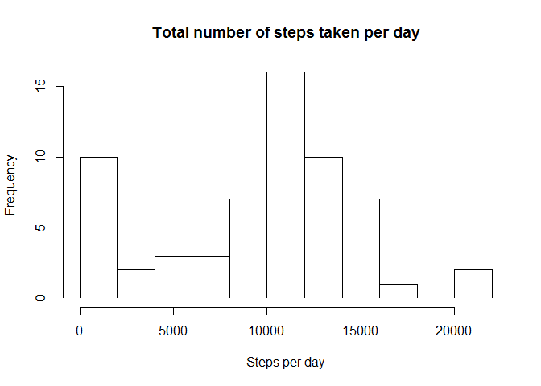
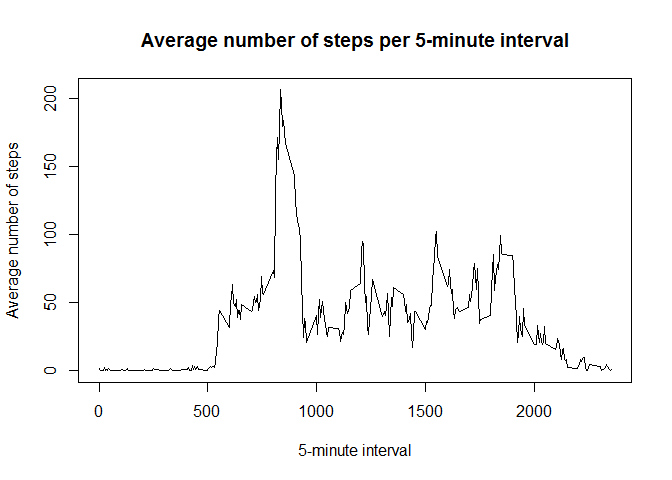
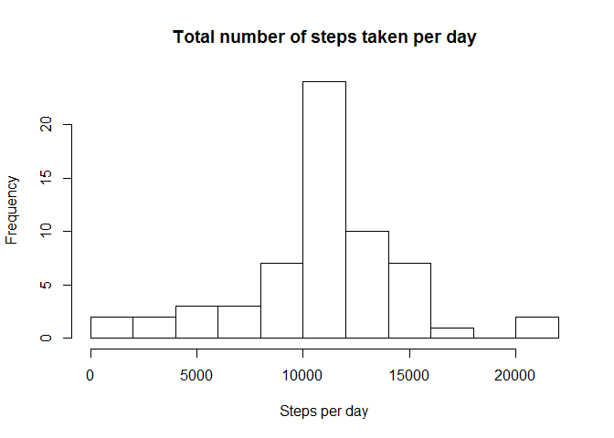
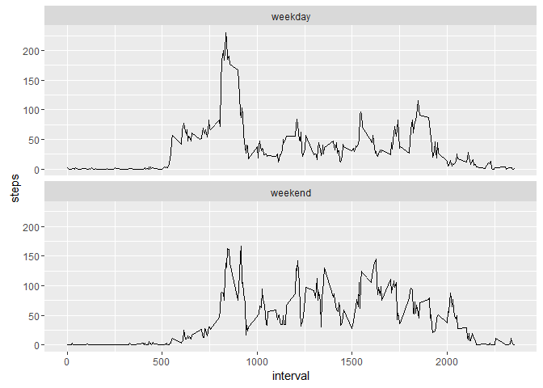

# Reproducible Research: Peer Assessment 1
Load libraries

```r
Sys.setlocale("LC_ALL","English")
library(dplyr)
library(ggplot2)
```

## Loading and preprocessing the data


```r
activity <- tbl_df(read.csv("activity.csv", colClasses = c("integer", "Date", "integer")))
```

## What is mean total number of steps taken per day?

1. Calculate the total number of steps taken per day

```r
steps_per_day <- activity %>% group_by(date) %>% summarize(steps = sum(steps, na.rm = TRUE))
```

2. Histogram of the total number of steps taken each day

```r
hist(steps_per_day$steps, 
     breaks = 10,
     main = "Total number of steps taken per day", 
     xlab = "Steps per day")
```



3. Mean and median number of steps taken each day

```r
steps_mean <- mean(steps_per_day$steps)
steps_median <- median(steps_per_day$steps)
```
The mean of total number of steps taken per day is **9354.23**, the median is **10395**.

## What is the average daily activity pattern?

1. Calculate average number of steps taken, averaged across all days 

```r
steps_per_interval <- activity %>% group_by(interval) %>% summarize(steps_average = mean(steps, na.rm = TRUE))
```

2. Make a time series plot

```r
plot(x = steps_per_interval$interval, y = steps_per_interval$steps_average, type = "l",
     xlab = "5-minute interval",
     ylab = "Average number of steps",
     main = "Average number of steps per 5-minute interval")
```



3. The 5-minute interval that, on average, contains the maximum number of steps

```r
interval_max_steps <- steps_per_interval %>% filter(steps_average == max(steps_average))
```

Interval **835** with average number of steps **206.1698113**

## Imputing missing values
1. Calculate and report the total number of missing values in the dataset

```r
nrow(activity %>% filter(!complete.cases(.)))
```

```
## [1] 2304
```

2. Create a new dataset that is equal to the original dataset but with the missing data filled in. Strategy - mean for that 5-minute interval


```r
activity_imputed <- activity %>% group_by(interval) %>% mutate(steps = ifelse(is.na(steps), mean(steps, na.rm = TRUE), steps)) %>% ungroup()
```

3. Make a histogram of the total number of steps taken each day and Calculate and report the mean and median total number of steps taken per day.

```r
steps_per_day_new <- activity_imputed %>% group_by(date) %>% summarize(steps = sum(steps, na.rm = TRUE))

hist(steps_per_day_new$steps, 
     breaks = 10,
     main = "Total number of steps taken per day", 
     xlab = "Steps per day")
```



```r
steps_mean_new <- mean(steps_per_day_new$steps)
steps_median_new <- median(steps_per_day_new$steps)
```
The mean of total number of steps taken per day is **10766.19**, the median is **10766.19**.

As we see this values differ from first ones (mean **9354.23**, median **10395**). New mean and median are equal to each other and slightly greater than the first ones.

## Are there differences in activity patterns between weekdays and weekends?
1. Create a new factor variable in the dataset with two levels – “weekday” and “weekend” indicating whether a given date is a weekday or weekend day.

```r
activity_imputed2 <- activity_imputed %>% mutate(week_day = weekdays(date), week_factor =  factor(ifelse(week_day %in%  c('Sunday', 'Saturday'), "weekend", "weekday")))
```

2. Make a panel plot containing a time series plot of the 5-minute interval (x-axis) and the average number of steps taken, averaged across all weekday days or weekend days (y-axis)

```r
summary <- activity_imputed2 %>% group_by(interval, week_factor) %>% summarise(steps = mean(steps))
ggplot(aes(interval, steps), data = summary) + geom_line() + facet_wrap(~week_factor, nrow = 2)
```



So people walk all day on weekend and mostly in the morning on weekday.
